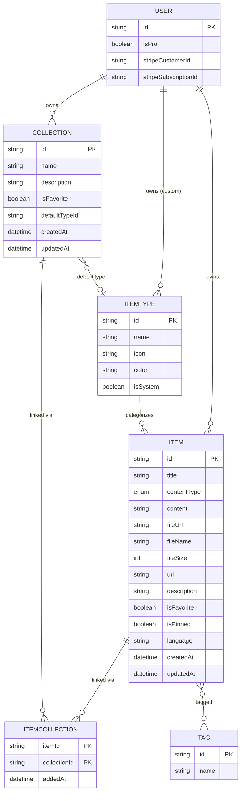

# DevStash — Project Specification

> ONE fast, searchable, AI-enhanced hub for all developer knowledge and resources.

---

## 1. Problem (Core Idea)

Developers keep their essentials scattered across too many places:

| Resource | Where it usually lives |
| --- | --- |
| Code snippets | VS Code, Notion |
| AI prompts | Chat histories |
| Context files | Buried in projects |
| Useful links | Browser bookmarks |
| Docs | Random folders |
| Commands | `.txt` files |
| Project templates | GitHub gists |
| Terminal commands | Bash history |

This scattering causes **context switching**, **lost knowledge**, and **inconsistent workflows**. DevStash consolidates all of it into a single fast, searchable, AI-enhanced hub.

---

## 2. Users

- **Everyday Developer** — grabs snippets, prompts, commands, and links fast.
- **AI-first Developer** — saves prompts, contexts, workflows, and system messages.
- **Content Creator / Educator** — stores code blocks, explanations, and course notes.
- **Full-stack Builder** — collects patterns, boilerplates, and API examples.

---

## 3. Features

### A. Items & Item Types

Items have a **type**. Users will eventually be able to create custom types, but the following **system types** ship first and cannot be edited or deleted:

| Type | Content kind | Tier | Route |
| --- | --- | --- | --- |
| `snippet` | text | Free | `/items/snippets` |
| `prompt` | text | Free | `/items/prompts` |
| `note` | text | Free | `/items/notes` |
| `command` | text | Free | `/items/commands` |
| `link` | url | Free | `/items/links` |
| `file` | file | Pro | `/items/files` |
| `image` | file | Pro | `/items/images` |

A type resolves to one of three content kinds: **text** (snippet, note, prompt, command), **url** (link), or **file** (file, image).

Items should be quick to create and open — both happen inside a **drawer** rather than a full page navigation.

### B. Collections

- Users create collections that can hold items of **any type**.
- An item can belong to **multiple collections** (e.g. a React snippet in both *React Patterns* and *Interview Prep*) — a many-to-many relationship handled via a join table.

Examples: *React Patterns* (snippets, notes), *Context Files* (files), *Python Snippets* (snippets).

### C. Search

Powerful search across **content**, **tags**, **titles**, and **types**.

### D. Authentication

- Email / password
- GitHub OAuth

### E. Other Features

- Favorite collections and items
- Pin items to top
- Recently used
- Import code from a file
- Markdown editor for text types
- File upload for file types (file / image)
- Export data in multiple formats
- Dark mode (default for devs), light mode optional
- Add / remove items to/from multiple collections
- View which collections an item belongs to

### F. AI Features (Pro only)

- AI auto-tag suggestions
- AI summaries
- AI "Explain This Code"
- Prompt optimizer

---

## 4. Data Model

> Draft schema — not set in stone.

### Entity Relationship Overview



### Prisma Schema (Prisma 7)

> **Prisma 7 notes:** the generator now uses the `prisma-client` provider (not `prisma-client-js`), generated output lives in your source tree, and a `prisma.config.ts` file is required for migrations/introspection.

```prisma
// schema.prisma

generator client {
  provider = "prisma-client"
  output   = "../src/generated/prisma"
}

datasource db {
  provider = "postgresql"
  url      = env("DATABASE_URL")
}

// --- Content kind for an item's payload ---
enum ContentType {
  text
  url
  file
}

// Extends NextAuth's base User
model User {
  id                   String     @id @default(cuid())
  email                String     @unique
  name                 String?
  image                String?

  // Billing / entitlement
  isPro                Boolean    @default(false)
  stripeCustomerId     String?    @unique
  stripeSubscriptionId String?    @unique

  // Relations
  items                Item[]
  collections          Collection[]
  itemTypes            ItemType[] // custom (user-owned) types only

  accounts             Account[]  // NextAuth
  sessions             Session[]  // NextAuth

  createdAt            DateTime   @default(now())
  updatedAt            DateTime   @updatedAt

  @@map("users")
}

model ItemType {
  id       String  @id @default(cuid())
  name     String
  icon     String
  color    String
  isSystem Boolean @default(false)

  // null for system types; set for user-created custom types
  userId   String?
  user     User?   @relation(fields: [userId], references: [id], onDelete: Cascade)

  items             Item[]
  defaultForCollections Collection[] @relation("CollectionDefaultType")

  @@unique([userId, name])
  @@index([userId])
  @@map("item_types")
}

model Item {
  id          String      @id @default(cuid())
  title       String
  contentType ContentType @default(text)

  // Text payload (null when file-based)
  content     String?

  // File payload (null when text-based)
  fileUrl     String?     // Cloudflare R2 URL
  fileName    String?
  fileSize    Int?        // bytes

  // Link payload
  url         String?

  description String?
  isFavorite  Boolean     @default(false)
  isPinned    Boolean     @default(false)
  language    String?     // optional syntax-highlight hint for code

  // Relations
  userId      String
  user        User        @relation(fields: [userId], references: [id], onDelete: Cascade)

  itemTypeId  String
  itemType    ItemType    @relation(fields: [itemTypeId], references: [id])

  tags        Tag[]
  collections ItemCollection[]

  createdAt   DateTime    @default(now())
  updatedAt   DateTime    @updatedAt

  @@index([userId])
  @@index([itemTypeId])
  @@map("items")
}

model Collection {
  id            String   @id @default(cuid())
  name          String
  description   String?
  isFavorite    Boolean  @default(false)

  // Default type for a brand-new, empty collection
  defaultTypeId String?
  defaultType   ItemType? @relation("CollectionDefaultType", fields: [defaultTypeId], references: [id])

  userId        String
  user          User     @relation(fields: [userId], references: [id], onDelete: Cascade)

  items         ItemCollection[]

  createdAt     DateTime @default(now())
  updatedAt     DateTime @updatedAt

  @@index([userId])
  @@map("collections")
}

// Join table: Item <-> Collection (many-to-many, with metadata)
model ItemCollection {
  itemId       String
  item         Item       @relation(fields: [itemId], references: [id], onDelete: Cascade)

  collectionId String
  collection   Collection @relation(fields: [collectionId], references: [id], onDelete: Cascade)

  addedAt      DateTime   @default(now())

  @@id([itemId, collectionId])
  @@index([collectionId])
  @@map("item_collections")
}

model Tag {
  id    String @id @default(cuid())
  name  String @unique
  items Item[]

  @@map("tags")
}
```

> **Migrations rule (hard constraint):** never use `prisma db push` or edit the database structure directly. All schema changes go through **migrations**, run in dev first, then promoted to prod.

---

## 5. Tech Stack

### Framework & Language

- **Next.js 16 / React 19** — SSR pages with dynamic components.
- **API routes** for backend needs (storing items, file uploads, AI calls).
- Single codebase / repo to reduce overhead.
- **TypeScript** for type safety.

### Database & ORM

- **Neon** — cloud-hosted PostgreSQL.
- **Prisma 7** (latest) — ORM for DB connection and interaction. *(Fetch latest docs; note the Prisma 7 breaking changes above.)*
- **Redis** — caching *(maybe / optional)*.

### File Storage

- **Cloudflare R2** — file and image uploads.

### Authentication

- **NextAuth v5**
  - Email / password
  - GitHub OAuth

### AI Integration

- **OpenAI** — `gpt-5-nano` model.

### Styling

- **Tailwind CSS v4** with **shadcn/ui**.

---

## 6. Monetization (Freemium)

| Capability | Free | Pro |
| --- | --- | --- |
| Items | 50 total | Unlimited |
| Collections | 3 | Unlimited |
| System types | All except file / image | All |
| Search | Basic | Basic |
| File & image uploads | ❌ | ✅ |
| Custom types | ❌ | ✅ *(later)* |
| AI auto-tagging | ❌ | ✅ |
| AI code explanation | ❌ | ✅ |
| AI prompt optimizer | ❌ | ✅ |
| Export data (JSON / ZIP) | ❌ | ✅ |
| Support | Standard | Priority |

**Pricing:** Pro is **$8/month** or **$72/year**.

> **Dev note:** build the foundation for the Pro tier now (entitlement flags, gating hooks), but during development all users can access everything.

---

## 7. UI / UX

### General

- Modern, minimal, developer-focused.
- Dark mode by default; light mode optional.
- Clean typography, generous whitespace.
- Subtle borders and shadows.
- **References:** Notion, Linear, Raycast.
- Syntax highlighting for code blocks.

### Layout

- **Sidebar + main content**, collapsible sidebar.
- **Sidebar:** item types linking to their item lists (Snippets, Commands, etc.) plus latest collections.
- **Main:** grid of color-coded **collection cards** (background color derived from the item type they hold most of). Items display under collections as color-coded cards (**border** color by type).
- Individual items open in a **quick-access drawer**.

### Type Colors & Icons

Icons reference the [lucide-react](https://lucide.dev) set (shadcn/ui default).

| Type | Color | Hex | Icon |
| --- | --- | --- | --- |
| Snippet | 🔵 Blue | `#3b82f6` | `Code` |
| Prompt | 🟣 Purple | `#8b5cf6` | `Sparkles` |
| Command | 🟠 Orange | `#f97316` | `Terminal` |
| Note | 🟡 Yellow | `#fde047` | `StickyNote` |
| File | ⚪ Gray | `#6b7280` | `File` |
| Image | 🌸 Pink | `#ec4899` | `Image` |
| Link | 🟢 Emerald | `#10b981` | `Link` |

### Responsive

- Desktop-first, mobile usable.
- Sidebar collapses into a drawer on mobile.

### Micro-interactions

- Smooth transitions
- Hover states on cards
- Toast notifications for actions
- Loading skeletons

---

## Appendix — Open Questions / To Confirm

- **Redis caching** — confirm whether it's in the MVP or deferred.
- **Custom item types** — Pro feature marked "later"; not in the first build.
- **Free-tier search** vs Pro search — both currently marked "Basic"; confirm whether Pro gets enhanced (e.g. AI/semantic) search.
- **Tags** — currently global-unique by name. Confirm whether tags should be scoped per-user instead (two users likely want their own `react` tag).
